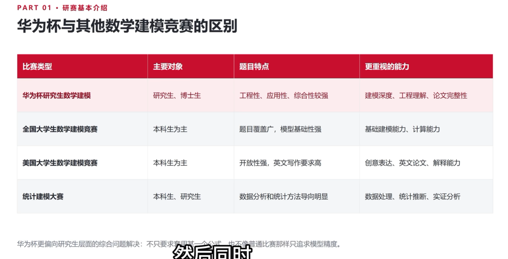
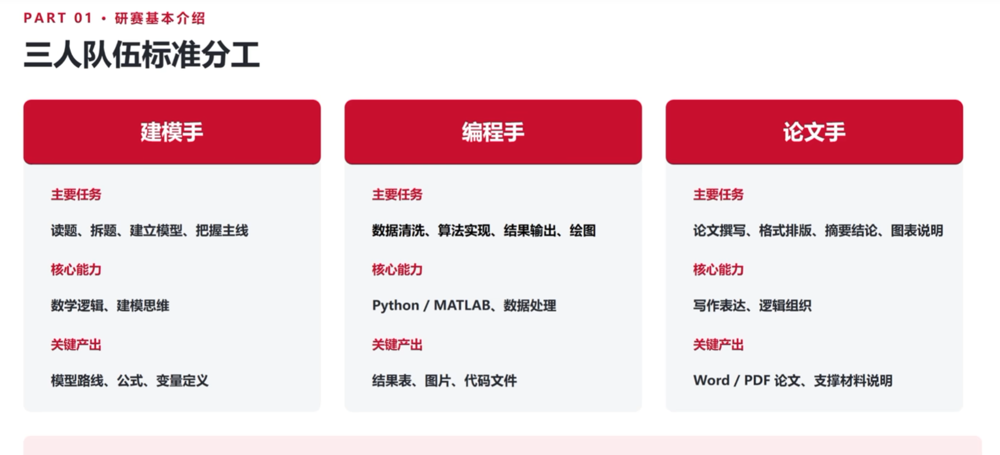
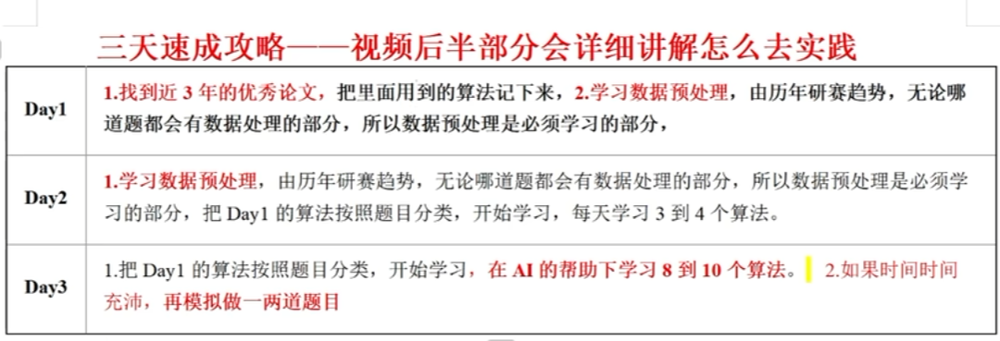

# 研究生数学建模竞赛协作仓库

这是我参加中国研究生数学建模竞赛的长期学习、建模、编程与论文写作仓库，也是与 Codex 协作的工作目录。仓库记录可复现的代码、实验结果、建模思路和竞赛过程；原始资料、论文合集和大型压缩包保存在独立的资料目录中。

## 竞赛简介

研究生数学建模竞赛强调面向真实问题的综合解决能力。相比只追求公式或程序的练习，研究生赛题通常更重视问题抽象、工程理解、数据分析、模型深度和论文完整性。







## 赛题分类（根据视频教程）

### 评价决策类

对多个方案、指标或对象进行综合评价、排序和优选。

| 常用方法 | 选用原因 |
| --- | --- |
| 层次分析法（AHP） | 指标层次清楚，需要表达专家偏好；结构直观、解释性强。 |
| 熵权法 | 希望减少主观赋权；根据数据离散程度客观确定权重。 |
| TOPSIS | 需要对多个方案排序；同时考虑距正、负理想解的距离。 |
| 灰色关联分析 | 样本少、信息不完整；适合比较因素关联程度。 |
| 主成分分析（PCA） | 指标多且存在相关性；降维并缓解共线性。 |

### 预测类

根据历史数据预测未来趋势、数值或状态。

| 常用方法 | 选用原因 |
| --- | --- |
| 线性/多项式回归 | 关系较简单且需要可解释公式；适合作为基线。 |
| 指数平滑 | 单变量序列有水平、趋势或季节性；短期预测简单稳定。 |
| ARIMA | 数据是平稳或可差分的时间序列；能描述自回归和移动平均。 |
| 灰色预测 GM(1,1) | 样本少且呈明显趋势；对数据量要求较低。 |
| 随机森林 / XGBoost | 结构化数据中非线性和特征交互明显；预测精度通常较高。 |
| 神经网络 | 样本量较大、关系高度非线性；表达能力强但需要调参。 |

### 优化调度类

在资源、时间、容量或路径约束下寻找成本最低、收益最大或效率最高的方案。

| 常用方法              | 选用原因                             |
| ----------------- | -------------------------------- |
| 线性规划（LP）          | 目标和约束均为线性；求解器成熟且可得到全局最优解。        |
| 整数/混合整数规划（IP/MIP） | 选址、排班、分配等变量必须取整数；能表达逻辑约束。        |
| 多目标/目标规划          | 成本、收益、时间等目标冲突；便于权衡多个目标。          |
| 动态规划              | 决策分阶段且具有最优子结构；适合路径、库存和序列决策。      |
| 遗传算法              | 非线性、离散、不可导或搜索空间很大；编码灵活、全局搜索能力较强。 |
| 粒子群 / 模拟退火        | 连续参数优化或容易陷入局部最优；实现简单且能进行随机搜索。    |

### 分类识别类

根据特征将样本划分类别，或识别异常、故障和图像目标。视频第 06 集重点讲解分类与聚类方法；第 07 集的仿真、图论方法也常用于此类综合题。

**分类模型**

| 常用方法       | 选用原因                        |
| ---------- | --------------------------- |
| 逻辑回归       | 类别边界大致线性；训练快、可解释并能输出概率。     |
| 支持向量机（SVM） | 小样本、高维或非线性边界；核函数可处理复杂边界。    |
| 随机森林       | 表格数据、非线性和多特征；抗过拟合并可给出特征重要性。 |
| XGBoost    | 结构化数据且追求较高精度；擅长复杂非线性和特征交互。  |

**聚类模型**

| 常用方法 | 选用原因 |
| --- | --- |
| K-means | 无标签且簇较紧凑；速度快，适合先探索群组结构。 |
| 层次聚类 | 需要观察样本的层次关系或暂时不确定簇数；可用树状图解释。 |

### 仿真与图论类

这类方法可独立成题，也可作为评价、预测或优化模型的子模块。

| 常用方法 | 选用原因 |
| --- | --- |
| Monte Carlo 蒙特卡洛 | 过程具有随机性，需要估计概率、期望或风险；适用范围广。 |
| 离散事件/系统仿真 | 排队、生产、服务等过程按事件推进；能比较不同策略。 |
| 元胞自动机 | 个体按局部规则演化且有空间结构；适合交通流和扩散模拟。 |
| Dijkstra / Floyd 最短路 | 需要求单源或全源最短路径；算法成熟、结果清晰。 |
| Prim / Kruskal 最小生成树 | 需要以最低总成本连接所有节点；适合道路、通信和管线设计。 |
| 最大流/最小割 | 网络存在容量上限或运输瓶颈；可求最大流量并定位瓶颈。 |

**基本选型顺序**：先判断有无标签，再识别数据规模、线性/非线性、确定性/随机性和约束类型；最后综合精度、稳定性、解释性、运行时间和论文呈现效果。

## 2023—2025 年赛题统计与备赛结论

以下统计来自本地资料目录 `【华为杯研究生数模04-25年赛题题目】`。分类按每道题最主要的输出任务确定；“兼有类型”用于标记同一道题中的其他建模环节。

### 2023 年

| 题目 | 主分类 | 兼有类型 |
| --- | --- | --- |
| A WLAN 网络信道接入机制建模 | 仿真图论 | 优化调度、排队分析 |
| B DFT 类矩阵的整数分解逼近 | 优化调度 | 数值计算 |
| C 大规模创新类竞赛评审方案研究 | 评价决策 | 统计分析 |
| D 区域双碳目标与路径规划研究 | 优化调度 | 预测、评价决策 |
| E 出血性脑卒中临床智能诊疗建模 | 分类识别 | 预测、特征分析 |
| F 强对流降水临近预报 | 预测 | 时空分析、分类识别 |

### 2024 年

| 题目 | 主分类 | 兼有类型 |
| --- | --- | --- |
| A 风电场有功功率优化调度 | 优化调度 | 预测、疲劳评估 |
| B WLAN 组网中网络吞吐量建模 | 预测 | 回归、仿真 |
| C 数据驱动下磁性元件的磁芯损耗建模 | 预测 | 回归、特征分析 |
| D 大数据驱动的地理综合问题 | 预测 | 评价决策、时空分析、分类识别 |
| E 高速公路应急车道紧急启用模型 | 仿真图论 | 预测、优化调度、交通流分析 |
| F X 射线脉冲星光子到达时间建模 | 仿真图论 | 预测、轨道计算、随机过程 |

### 2025 年

| 题目 | 主分类 | 兼有类型 |
| --- | --- | --- |
| A 通用神经网络处理器下的核内调度问题 | 优化调度 | 整数规划、启发式算法 |
| B 无线通信系统链路速率建模 | 预测 | 回归、机器学习 |
| C 围岩裂隙精准识别与三维模型重构 | 分类识别 | 图像处理、三维重构 |
| D 低空湍流监测及最优航路规划 | 优化调度 | 预测、图论、风险评价 |
| E 高速列车轴承智能故障诊断问题 | 分类识别 | 信号处理、特征提取、迁移学习 |
| F 江南古典园林的美学特征建模 | 评价决策 | 多模态数据、聚类分析 |

### 数量统计

| 主分类 | 2023 | 2024 | 2025 | 三年合计 |
| --- | ---: | ---: | ---: | ---: |
| 评价决策 | 1 | 0 | 1 | 2 |
| 预测 | 1 | 3 | 1 | 5 |
| 优化调度 | 2 | 1 | 2 | 5 |
| 分类识别 | 1 | 0 | 2 | 3 |
| 仿真图论 | 1 | 2 | 0 | 3 |
| 合计 | 6 | 6 | 6 | 18 |

### 近年趋势与选题策略

- 题目越来越依赖真实数据、时空信息、图像/信号和领域知识，单一算法通常不能完成整道题。
- A、B 题常出现较强的专业背景、复杂约束、数值推导或大规模数据处理，准备成本较高；它们适合作为进阶训练，不宜作为半个月备赛的唯一目标。
- C、D、E、F 题覆盖分类识别、预测、优化、评价和仿真等高频任务，更适合用现有代码资料快速建立基线，再通过数据处理和验证提升结果。
- 备赛优先顺序建议为 **C/E/F → D → B → A**：先掌握可复用的分类、评价、预测和图表流程，再挑战专业性更强的 A、B 题。
- 比赛选题时先看数据是否可读、问题是否能拆分、验证指标是否明确，再考虑模型是否高级；能完整验证并写清楚的方案优先于复杂但不稳定的方案。

### 资料使用顺序

1. 先读 2023—2025 题目文件，完成上面的题型索引，不直接通读全部历史资料。
2. 优先研究 `重点学习优秀论文` 中的 B、C、E、F 题，再到 `04-25年优秀论文` 中补充相同类型的论文。
3. 按题型调用 `数学建模程序代码资料合集` 和 `matlab经典十个算法的程序` 中的最小模板，自己重写并验证。
4. 用 2024 年 E 题交通流、2024 年 F 题脉冲星或 2025 年 C/E 题做专项练习；最后用 2025 年 D 题做综合模拟。

## 仓库目标

- 建立从读题、假设、建模、求解、验证到写作的完整工作流
- 沉淀可复用的 MATLAB / Python 建模代码与数据处理脚本
- 按赛题和方法整理实验记录，保证结果能够复现
- 在比赛期间支持多人协作、版本回溯和阶段性归档

## 目录约定

```text
.
├── README.md              # 仓库说明与协作约定
├── assets/                # README 和文档使用的图片
├── skills/                # 面向华为杯研赛的可复用 Codex Skill
├── 提示词教学.docx         # 与建模协作相关的提示词学习材料
├── problems/              # 历年赛题、当前赛题与题目分析
├── solutions/             # 各题建模方案、推导和实验记录
├── src/                   # MATLAB / Python 等可复用代码
├── data/                  # 项目所需的小型、可公开分发的数据
├── results/               # 图表、指标和阶段性实验结果
└── paper/                 # 论文草稿、公式和 LaTeX / Word 素材
```

目录会随着比赛推进逐步建立。每个具体题目建议使用独立子目录，例如 `solutions/2026/A/`，并在其中记录 README、代码、数据说明和结果。

## 建模工作流

1. **读题与拆解**：明确目标、约束、输入输出和评价指标。
2. **数据检查**：记录数据来源、字段含义、缺失值和异常值处理方式。
3. **建立模型**：写清假设、符号、目标函数、约束和算法选择理由。
4. **实现与验证**：固定随机种子或参数，保存关键中间结果，比较基线方法。
5. **敏感性分析**：检查参数变化、误差传播和模型适用范围。
6. **论文写作**：同步整理图表、结论、局限性和参考文献，避免最后集中返工。

## Python 环境

仓库使用 [uv](https://docs.astral.sh/uv/) 管理 Python 依赖，版本和锁定结果分别记录在 `pyproject.toml` 与 `uv.lock`。首次配置环境：

```powershell
$env:UV_CACHE_DIR = "$env:TEMP\\uv-cache-codex"
uv venv .venv --python 3.13
uv sync
```

运行脚本时使用项目虚拟环境：

```powershell
uv run python reports/2025-C/code/run_baseline.py
uv run python reports/2025-C/code/make_report_figures.py
```

当前环境包含 NumPy、Pandas、Pillow、OpenCV、SciPy、scikit-learn、Matplotlib、Seaborn、NetworkX、Statsmodels、OpenPyXL、python-docx 和 Jupyter。

## 协作约定

- 一个题目或一个功能使用一个分支，提交信息采用 `feat`、`fix`、`docs`、`refactor`、`test`、`chore` 前缀。
- 提交前说明改动目的、运行方法和验证结果；生成的缓存、临时文件和个人配置不要提交。
- 代码、数据和图表尽量提供最小可运行示例；大型资料通过外部链接或本地资料目录管理。
- 涉及题目保密、个人信息或未公开数据时，先确认是否允许上传到云端。

## 外部资料

完整资料位于本机的 `F:/goodstudy/研0/竞赛/数模/`，包括历年赛题、优秀论文、算法代码和 2026 年华为杯资料。仓库只保留经过筛选、可公开分享且与当前题目直接相关的内容。

- [历年研究生数模真题与资料](https://github.com/zhanwen/MathModel)
- [2026 华为杯数学建模资料（百度网盘）](https://pan.baidu.com/s/1VKKoEsld9yT721EkPfpBGg?pwd=67w0)

## 当前计划

- [ ] 建立历年赛题索引和题型标签
- [ ] 整理评价决策、预测、优化调度、分类识别四类基础模板
- [ ] 补充 MATLAB / Python 环境与运行说明
- [ ] 为 2026 年赛题建立独立的问题分析和实验目录
- [ ] 形成可直接复用的论文写作清单
