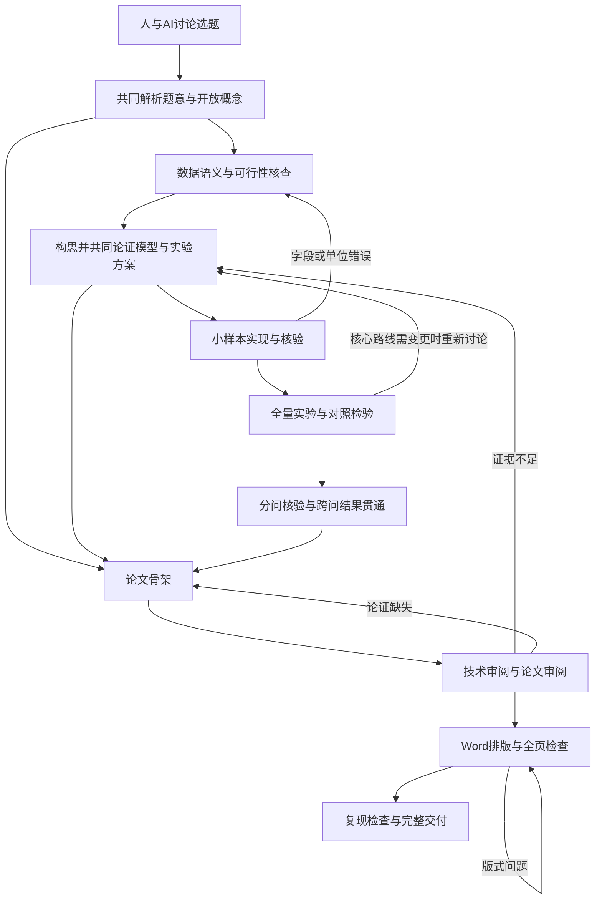

# 华为杯数模 Skill 重做要求与开发、建模、论文流程

版本：0.4.0-draft · 更新日期：2026-09-22 · 状态：仿真训练、创新与辩证规程、优秀论文解剖已接入；完整赛题和盲测仍待完成。

本文件是重做版的唯一有效工作规范。目标来自用户对“完整、逻辑严谨、内容深度和格式媲美优秀获奖论文”的要求。旧版生成物达不到该目标，不能靠扩充篇幅、增加检查项或改文件名解决。

目录：

0. 人与 AI 的讨论与决策\r\n1. 目标与验收要求
2. 本次审计与参考资料
3. 开发约定与项目组织
4. 从读题到交付的工作流程
5. 数据和数学模型要求
6. 实验与验证要求
7. 论文内容与行文要求
8. Word 排版与交付要求
9. 审阅、失败处理和完成定义
10. Skill 重建顺序
11. 回归与实战验收设计

## 0. 人与 AI 的讨论与决策

用户要求先充分讨论，再确定建模与实现方案，之后分步推进。默认协作模式据此调整：Skill 提供分析框架、理论核查和实验工具；选题、研究对象的定义及关键模型路线由人与 AI 共同确定。不能接到一道开放题就自动套模型、跑完并交一篇论文。

### 0.1 需要共同形成的决定

| 决定 | AI 先准备什么 | 队伍参与决定什么 |
| --- | --- | --- |
| 选题 | 对照题面、数据可获得性、队伍领域知识、实现成本、创新空间与主要风险比较候选题 | 选哪题、优先研究哪部分；已有明确选择则不重选 |
| 题意与概念 | 拆出明确要求和开放解释；说明“美感、移步异景、风险”等概念有哪些不同理解 | 我们要刻画什么、保留什么、暂不声称什么；哪些假设能接受 |
| 模型与实验方案 | 提出实质不同的候选思路，给出定义、理由、反例、数据支持、实现步骤和检验方法 | 选定主线、必要对照、首个实验范围及跨问接口 |
| 重要路线改变 | 展示失败证据、原方案为何不足，以及新方案的影响与成本 | 是否改变核心定义、研究目标、数据来源或模型主线 |

讨论问题来自真实分歧，不机械凑轮次。每轮给用户简明可比较的内容、自己的判断和最关键的待决定问题；不能只问“用什么模型”把分析责任交给用户。未得到关键决定时，继续读题、数据清点、文献查证等不依赖该决定的工作，不把用户沉默当作认可。

核心方案确定后，在约定阶段内自主实现、排错、运行和核验，不为绘图配色、修复报错、合理参数搜索等重复请求许可。按约定的单问或阶段范围交付可审阅结果，再讨论必要的科学判断；用户明确授权连续执行的部分不再逐步询问“继续吗”。

用户之后明确要求自动完成某个已定方案时，以最新授权为准。这里的讨论节点来自用户的研究协作偏好，不是工具安装或脚本自动设置的审批流程。

### 0.2 讨论如何变成可执行方案

在项目现有决策记录或 `project.yaml` 中记下：问题与目标、候选思路、选定理由、理论依据、假设/未知项、用户已确定的内容、验证设计、下一步实施范围。保留可审查的公式推导和决策摘要，不把聊天全文当论文。

方案是否成熟看四点：我们知道要测什么；数据能支持这一定义；数学表达经得住反例；实验能区分方案是否有效。未达到时继续讨论或做明确标记的探索性小实验，不能先生成完整正文再倒推模型理由。

本轮任务是完善指导方针。2025 F 是开放建模的讨论范例，D 问题一是历史错误的回归候选；两者都不代表已经替队伍选定下一道实战题。

## 1. 目标与验收要求

### 1.1 要达到的结果

Skill 应帮助队伍完成真实赛题的研究过程，并产出能由队员解释、能由他人复现、能经受逐段追问的中文建模论文。对标优秀论文的完整论证与专业表达；获奖需要真实竞赛评审，内部评分不能证明获奖水平。

| 编号 | 要求 | 可审查的完成证据 |
| --- | --- | --- |
| R1 题目完整性 | 逐项回答每问的任务、约束、范围和附件要求，包括题面指定的图、表、文件 | 题目条款到结果及论文章节的对应表；未覆盖项为零，排除项有题面依据 |
| R2 科学正确性 | 字段语义、量纲、假设、公式和实现一致，代理指标有依据 | 格式说明定位、推导、已知解/物理检查、关键代码定位及审阅结论 |
| R3 方法有效性 | 有效性证据与所声称能力匹配，比较公平，结论有适用范围 | 基线/参照、预先定义的评价方式、验证集或替代证据、误差与失败案例 |
| R4 可追溯性 | 摘要数字、主要结论、图和表都能回溯到运行输出或原始文献 | 结果索引、输入/代码/配置指纹、结果行列或键值位置、引用来源 |
| R5 论文深度 | 不读聊天和代码也能理解题目抽象、建模理由、求解过程、结论及其局限 | 逐问完整章节；审阅者可回答第 7 节的问题；重要推导和结果留在正文 |
| R6 专业格式 | 可编辑 Word 与对应 PDF 一致，公式、图表、编号、引用和分页专业 | 样式规范、结构检查、最新全页渲染和修复记录 |
| R7 开发可复现 | 他人按运行说明能够重建核心结果，失败可定位，改动不会静默使用过期结果 | 锁定依赖、配置、运行入口、日志、缓存失效规则和实际重跑记录 |
| R8 队伍可掌握 | 建模、编程、写作成员能说明各自结果和交接边界 | 对核心假设、关键参数、误差与局限的简明解释；审阅意见已处理 |

任一核心条款不能被总分平均抵消。完成一份真实、充分的论文是目标；堆模型名称、图数、字数或“国奖级”标签不计成果。对效果提升的数值目标，需要先看任务尺度、参照水平和可用验证条件，在比较实验前记录，不能看到结果后再调低通过线。

### 1.2 交付内容与边界

完整赛题交付包含：论文源稿、可编辑 DOCX、同版本 PDF、代码与环境锁、运行说明、题目规定的全部结果附件、运行索引和简明审阅记录。原始大数据保留在资料目录，写清取得方式和校验值；按官方要求决定哪些进入提交包。

练习与正式参赛区分：练习可以完成研究和全文写作；未核验当前比赛格式，只能说明格式尚未对照，不能笼统宣布整项研究被阻塞。正式提交前核验对应届次的模板、匿名、附件、AI 使用和提交规定；未核验的要求不能声称已满足。

已有代码、草稿、README 图片和分类保留。重做规范不授权提交 Git、推送、部署、删除旧成果或比赛系统提交。

## 2. 本次审计与参考资料

### 2.1 可以定位的失败原因

以下路径以仓库为根；行号对应重做前本次读取版本。证据用于规定能力缺口，不等同于本轮修复了项目。涉及的旧脚本已移入 `_archive/scripts/`，只作追溯。

| 证据 | 发现 | 重做要求 |
| --- | --- | --- |
| `skills/huawei-math-modeling/references/content-quota.yaml:9,16,18` | 每问 8000 字、全文 30000 字和 45—70 页被设为统一目标，未按题目证明必要性 | 取消统一配额，按任务与论证量制定章节预算；不足看缺失论证，过长看重复内容 |
| `skills/huawei-math-modeling/scripts/verify_submission_readiness.py:26,30,34` | 读取手工 PASSED、CSV 文件大小，并在 DOCX 压缩字节中找词，不能检验论文正文和科学结论 | 读取真实文档结构、结果与依赖；自动检查仅报告自己检查过的事实 |
| `skills/huawei-math-modeling/scripts/verify_docx_structure.py:35,41,56` | 固定四问，最后一问统计延伸到文档末尾，附录可能计入正文 | 从项目要求读取问题数量；按真实章节边界分开正文、参考文献与附录 |
| `skills/huawei-math-modeling/scripts/verify_docx_math.py:23` | 同时累加公式和公式容器，存在重复计数 | 检查实际公式节点与可编辑性；数量不能代替数学正确性 |
| `projects/2025-D/code/q1_full_profiles.py:39-47,65` | 微波记录仅按时间存储，产品类型可能覆盖；站点靠列表顺序映射 | 使用明确业务键与字段契约，保留来源和类型；站点配对需显式依据 |
| `projects/2025-D/code/q1_model_a_sample.py:35,43,56` | 气压未用于位温换算，却把插值温度标为位温；原始温度单位仍需查格式文件 | 检查定义、单位、物理公式和实现，不能用变量名给数值赋予物理含义 |
| `projects/2025-D/code/q1_turbulence_profile.py:64`；`q1_full_profiles.py:74-76,97` | Ri 代理量量纲不符；单时刻高度均值偏差被当作湍流统计；写出文件即输出 PASS | 明确统计窗口与代理量校准；程序成功与科学验收分开 |

当前 C 题不能沿用全部历史批评：`projects/2025-C/reports/TECHNICAL_REVIEW.md:12-16` 和 `FINAL_VERIFICATION.md:17-19` 已记录坐标、部分漏检、积分、措辞及引用等修复。本次没有独立重算这些修复。当前报告仍指出真实图像误漏检、独立真值与部分标定不足；`PAPER_REVIEW.md:53` 记录 JRC 大量超参考区间。这些问题需回到识别和尺度/标定检验，增加正文和调整标题不能消除。

### 2.2 如何使用用户给的优秀论文

资料根目录：`F:/goodstudy/研0/竞赛/数模/2026华为杯研究生数学建模资料/`。优先利用 `重点学习优秀论文/` 与 `04-25年优秀论文/2025年研究生数学建模竞赛优秀论文选/`。

本轮抽查的具体依据：

| 资料与定位 | 可以学习的内容 | 不可据此断言 |
| --- | --- | --- |
| `重点学习优秀论文/C题-2-围岩裂隙精准识别与三维模型重构.pdf`，PDF 第 20 页，已渲染阅读 | 先说明问题二与问题一的联系，再展开实例聚类、参数拟合、方法比较；流程图与章节衔接，图注置下，标题有层级 | 不能据一页证明全文模型正确，不能照抄其精度和最优性结论 |
| `04-25年优秀论文/2025年研究生数学建模竞赛优秀论文选/D题优秀论文/D题-基于多源数据融合的低空湍流监测与航路优化.pdf`，PDF 第 20 页，已渲染阅读 | 说明 RMSE、MAE、相关性各自回答什么问题；公式编号、变量与解释相邻 | 网络结构图或指标列表本身不能证明训练和评估实际完成 |

两份文件分别为 78、110 页，包含其他部分，不能等同于正文页数。本轮文字提取存在字体映射乱码，已改用页面渲染核查上述页；其他未可靠读取的内容不作为重做结论的依据。资料夹名称不是获奖资格证明，其中广告、水印及效果数字不带入我们的论文。

2026-09-22 已用 `scripts/extract_paper_text.py` 逐页提取 `重点学习优秀论文/` 全部七篇（2025 B、2025 C、2025 F、2025 E 两篇、2024 C 两篇）并完成逐篇解剖，结论见 [优秀论文解剖](excellent-paper-deconstruction.md)：可迁移的是论证结构与验证方式，不迁移其模型堆砌、命名越界和结论数字。

以后为具体题目制定写作基准时，选择同题或相近方法的参考论文，记录“文件、版本/哈希、PDF 页码、正文与附录边界、值得借鉴的论证、不能沿用的假设”。抽查建模、结果与验证章节，不能只读摘要和目录。若正式规则限定篇幅，以规则为准重新分配。

开源参考保留：<https://github.com/woai66/math-modeling-skill>、<https://github.com/jihe520/MathModelAgent>。重建实现阶段核对具体提交版本、许可证、实际脚本及测试；比较任务拆解、结果交接、实验控制和写作机制。stars 只说明关注度，不替代质量验证；本轮没有新抓取代码，不声称已完整吸收或验证其实现。

### 2.3 会议纪要的参考范围

已完整提取阅读用户提供的 `F:/goodstudy/研0/竞赛/数模/数模纪要.docx`（文档标题“数学建模竞赛游园问题解题辅导-AI纪要”，77 个非空段落，无内嵌图片；SHA-256：`aaf9ab7fa3c07300e47971a2c4ff0f585ec0282eeb18101de21fb9accdfcfe63`）。原文件只读。以下段落号按正文非空段落顺序计数，不是 Word 页码。

纪要中值得落实的建议：指标必须写出计算过程，自创指标要论证合理性（第 44—47 段）；用实际数据计算并核验结果（第 7—9 段）；在原样本之外检验模型（第 57—60 段）；外部平面图自动提取后做人工校正与结构化整理（第 62—66 段）；建模、编程和写作分工协作（第 67—69 段）。

纪要是 AI 整理的教学记录，内容可能省略条件或转述有误。其任务提醒只作为资料，不构成用户指令；AI 使用规则、评分数字、具体赛程、题目首创性等陈述需另对照官方文件或可追溯来源，本轮没有把它们认定为事实。

| 纪要中的说法 | 应当澄清的数学问题 | 对讨论流程的启示 |
| --- | --- | --- |
| 度为 2 即转折点（17 段） | 直线路段的加密点也可为度 2；拓扑连通与几何转角不同 | 先定义转折的几何意义，再选择夹角/曲率等可计算量；检查采样变化是否影响结论 |
| 12 扇区静态切换与沿路动态变化（20—26 段） | 周向丰富但沿途不变，与单点简单但沿途变化是不同现象；扇区方向和首尾闭合需明确 | 讨论指标测“多样”还是“变化”，区分位置、朝向及遮挡的作用 |
| 切换次数除以点数再除长度（24—30 段） | N 个点有 N−1 个相邻区间；一次切换按该方式为 1/(NL)，只加密采样就会缩小 | 先选择事件密度、观察概率或累计变化量，再确定分母；做采样稳定性检验 |
| 相似度 0.2—1.6 无效以及 0.3/0.7 阈值（51—56 段） | 标准余弦非零向量结果在 [-1,1]，非负向量在 [0,1]；欧氏距离非负但无统一上界。分组不自动解决量纲问题 | 先明确度量、变换、范围和零向量处理，再讨论阈值依据；不能为符合预期修改热力图颜色或数据 |

纪要中的 12 扇区、7 个采样点、8 米可视宽度、指标权重和阈值均作为候选设置，是否采用取决于题面、数据、理论及敏感性分析，不作为所有项目的默认常量。

## 3. 开发约定与项目组织

### 3.1 工作环境

- 复用仓库的 `pyproject.toml`、`uv.lock` 和 `.venv`。先确认 Python/uv 与需要的库，再添加实际缺少的依赖；环境修复在授权范围内继续完成。数学实验使用项目环境，文档渲染可使用已记录版本的专用工具。
- 计算使用可配置路径，原始资料只读。数据目录可由 `--data-root` 或配置指定，运行说明不依赖开发者的用户名与临时目录。
- 正式数值流程用脚本入口；Notebook 用于探索，成熟逻辑收回可调用模块。合理拆分读取、预处理、模型、评估、图表和论文生成，避免把所有内容塞进一个生成论文脚本。
- 当前 Windows 环境绘图使用 `Agg`；中文路径图像读取使用验证过的 Pillow 或 OpenCV 编解码方式。只做与当前任务相关的环境调整。
- 启动计算前估计样本量、内存、磁盘和运行时间；先小样本核验，再全量运行。缓存绑定输入、代码和参数，三者变化则使对应缓存失效。

### 3.2 少量文件，各有唯一职责

新项目建议采用下列逻辑布局；已有 C/D 项目复用同职责文件，不为套目录移动或复制已有成果。

```text
projects/<year-topic>/
  project.yaml                 # 人维护：题目要求、数据契约、模型决策、评价设计、排版配置
  code/                        # 解析、建模、验证、绘图与运行入口
  results/<run_id>/
    manifest.json              # 程序生成：实际输入、配置、代码、结果和检查记录的权威索引
    ...                        # 数值表、结果附件与可追溯图表
  reports/review.md            # 有证据的技术/论文审阅意见与处理记录
  paper/                       # 一套论文源稿、DOCX、同版本 PDF、渲染检查记录
  README.md                    # 数据取得方式、环境、运行命令与交付说明
```

这是重建实现目标，不是本轮已创建的脚手架。不再每题机械复制 `plan.md + plan.yaml + todo.md + stage_status.json + 多份结果契约`。需要临时笔记可以写，不能再维护第二套“已通过”事实。旧文件保留作历史记录，正式接续时说明选择哪份作为当前索引。

`project.yaml` 的最小信息：来源和题面定位；逐条需求 ID、输入范围、输出类型/单位、依赖问题与验收方式；字段解释；候选与选择理由；实验划分/参照/评价指标；重要未知项；规则来源和排版配置。它记录计划与决定，不能冒充运行证据。

`manifest.json` 的最小信息：run_id、时间、完整命令、环境/锁文件指纹、实际代码哈希（包含未提交代码）、输入清单和哈希、参数/随机种子、产物相对路径与哈希、预期/有效/失败覆盖数、检查名称和证据位置。结论 ID 另映射到结果表的行列或键、单位、取整方式及论文章节；允许该映射由论文构建时补全，但必须保留来源。一次运行不足以支持某结论时可引用多个 run_id。

实际状态从当前依赖和记录推导。历史实验保留，选定版本由项目配置指向。数据、代码或参数变化后，旧运行仍可回看，但论文不能静默引用过期数值。

每阶段保存有语义的中间结果，不仅暂存图片：例如要素表、路径节点/边、逐位置特征、模型参数、逐样本结果及质量标志。每个跨问接口写清对象 ID、字段类型、单位、坐标/时间基准、缺失含义、上游 run_id、变换和版本；下游读取已核验结果，不从论文表格或手工复制值反推数据。数值改变产生新运行版本，保留前一版本及变更原因。

全题贯通时检查“上游输出是否就是下游输入”：对象和数量可对齐、单位相容、参数版本一致、误差/不确定性传递明确；从原始数据重建到摘要数字及每张结果图，按预设容差比较。在这一检查完成前可写分问草稿，但不把全文摘要和综合结论定稿。

### 3.3 队伍协作和 Git

建模成员负责题意、假设、公式及验证设计；编程成员负责数据实现、实验、结果和复现；论文成员同步把论证与证据组织成章节。每人都需要理解其他环节，角色不是把工作完全隔离的理由。

AI 默认由主代理推进；确有独立核验需求时优先一个只读审阅者，避免每个阶段都启动多代理。主代理自行复查须如实称为自查，不能写成“独立评审”。没有独立审阅者时仍可做建模和写作，并把独立审阅状态留待核验。

沿用用户授权规则：不主动 commit/push/rebase/amend；提交前总结范围和建议提交信息，一个逻辑改动一个提交。授权发布后使用标准 Git 与 gh，禁止 GitHub Contents API 逐文件上传。当前工作区含未提交成果，不为遵循分支模板而自动切分支或清理。

## 4. 从读题到交付的工作流程

先按第 0 节共同讨论决定关键科学问题，再在约定范围内执行。各环节有依赖，允许局部迭代和同步整理写作素材；常规检查不增加重复授权节点。



| 环节 | 主要动作 | 必须留下的结果 | 发现问题后如何继续 |
| --- | --- | --- | --- |
| 选题与读题 | 比较候选题；共同解释开放概念；提取任务、条件、输出与指定附件 | 已确定选题、题意解释、需求清单与待讨论分歧 | 先给分析与候选解释，用户参与决定；同时推进不依赖决定的查证 |
| 数据理解 | 阅读格式说明，取代表记录，核验单位、标识、时间、坐标和缺测；统计覆盖 | 数据契约、实际覆盖表、小样本核验 | 语义错误先修解析；不能“先画图再猜含义” |
| 建模讨论 | 从现象与机制构思定义、指标或约束，比较候选方法；共同论证验证方案 | 已讨论的模型主线、推导、反例、参数依据、实现与试验范围 | 主要分歧未明确时不进入全量求解；可做双方知情的探索性小实验 |
| 最小实验 | 选有代表性的样本、边界和已知解，打通一个问题的输入到输出 | 可运行结果、诊断、初步图表及公式实现检查 | 检查成立才扩大样本；样例成功不称全量完成 |
| 分步求解与贯通 | 按约定问题范围计算，保存中间数据，核对跨问依赖；公平比较和敏感性实验 | 可复用中间结果、结果附件、覆盖分母、指标、局限、正式图表 | 常规修复自主推进；核心目标或路线需变更则携证据重新讨论 |
| 写作迭代 | 随已验证实验完成逐问章节，再整合主线、摘要和评价 | 连贯正文、编号、来源和关键结论定位 | 无证据句子回到实验或降为限定结论，不能靠润色强化语气 |
| 完整审阅 | 从题面核对论文，并从结论反查代码/结果；查错误与断链 | 影响结论的缺陷清单和修复证据 | 科学、写作、版式分别回到对应环节 |
| 排版交付 | 按样式生成 Word/PDF，检查所有页面及结果包，复跑核心结果 | 同版本交付文件与准确的完成说明 | 修复后更新相关检查；不拿旧截图验收新文档 |

时间管理以实际比赛期限为准。读题时尽早验证最危险的数据和模型假设；全程同步写作；预留独立的复现、全文审阅和排版时间。临近截止时冻结已验证模型，修正确性和表达；没有新增证据理由就不临时堆复杂算法。赛前演练记录各环节实际耗时，再制定队伍时间表，不套用未经核验的固定赛程。

## 5. 数据和数学模型要求

### 5.1 数据语义先于计算

每个数据源明确：字段来源、产品类型、主键、时间基准、采样间隔、站点/样本标识、坐标系及轴向、物理单位、缺测/质量标志、合法范围、插值与外推边界。文件排序不能代替业务键；空值、缺测哨兵和零分开处理。

保留原始量及转换说明。温度、压力、高度、像素、实际长度、角度和角频率不能靠变量名猜单位。融合前检查时间/空间对齐误差，记录容差以及未匹配项；不能跨日期找“最近”记录却不设边界。插值、平滑、裁剪和归一化都要说明对信号与后续模型的影响。

开发集、验证集、测试集或预测时段在拟合预处理前划分。时间序列、同站点、多张同源图像和同机器信号，须考虑组内相关和信息泄漏；题面规定的参照模型与预测模型应有清楚数据边界。

### 5.2 模型说明必须能够指导实现

每个核心模型在写大规模代码前回答：

1. 本问要估计、预测、识别或优化的对象是什么，输出如何对应题面？
2. 观测量、未知量、参数、决策变量、索引和单位是什么？
3. 哪些假设必要，数据或文献为何支持；违反时结果如何变化？
4. 从数据到目标量的公式如何得到；目标函数、损失或约束为什么这样设计？
5. 参数怎样确定：题目给定、文献、标定、训练或人为设定？后者需解释和检验。
6. 如何求解、何时收敛、怎样处理退化/无解/缺失；计算成本能否承受？
7. 如何验证实现正确、效果有效；失败判断和替代路线是什么？

不是每问都需要优化目标函数或训练模型。说明适用的数学对象，不为了模板虚构目标、损失和创新。模型数量由任务决定；简单方法足够时保留简单方法，复杂模型有效时提供公平比较。

每个派生物理量核对量纲。物理代理评分须注明代理关系和标定范围，不能无依据命名为概率、真实湍动能或安全阈值；仅把名称加上 proxy 也不能证明有效。物理/工程指标超常见范围，应核查适用域、测量尺度和公式，不能截断以制造合理结果。

### 5.3 跨问依赖

明确哪些上游输出进入下游。识别误差、标定误差或风险场不确定性会传播时，要检查对最终结论/最优方案的影响。下游正确执行不能补救上游错误物理量。

2025 D 用作回归场景时，需按题面分别界定 a/b、观测融合 c、数值预报 d、观测外推 e 的输入与验证时段，不能用预测模型的数据构造其检验参照。航路采用题面允许区域及起终点；题面未给定的选择必须说明来源或假设，演示角点路径不能冒充指定任务的结果。

### 5.4 开放题的创新构思与理论论证

创新可以出现在问题表征、概念的可计算定义、机制、约束、结构关系或验证方法中，不必对应一个已有算法名称。成熟算法可以用于求解自建模型；自创名称或叠加多个算法并不能自动成为创新。也不因某题有独创背景就断言相关数学思想在人类研究中从未出现，需说明与可查文献的联系和具体贡献。

构思先发散再收敛。人与 AI 先讨论若干实质不同的解释或机制，不先用算法目录限制思考；再按理论、数据和实验筛选，而不是一上来强制“每问两个模型”。每个值得保留的想法回答：

1. **现象：**它刻画什么，哪些直观情景应得到不同结果？
2. **定义：**把现象转成哪些可观测量，如何组合成可计算对象，单位和定义域是什么？
3. **性质：**范围、边界、单调性、对称性、尺度/坐标/采样变化中的哪些性质应当成立？性质由任务决定，不能一概要求所有指标尺度不变。
4. **论证与反例：**哪些性质可以推导证明；什么情形会失败，是否把两个不相同的概念混在一起？
5. **可实现性：**题给数据是否有需要的高度、朝向、时间、标注或几何信息？缺少时能否合理近似，误差在哪里？
6. **可检验性：**最小例子、真实对照或外部样本怎样区分这个想法和普通方案，什么结果说明它不成立？

理论论证不等于给直觉配一个公式。数学性质能够证明的就给推导；关于人的审美、体验或现实因果的主张仍需要经验依据，不把数学有界性当作感知有效性。比较机制、文献核查和实验证据完成前，称“候选定义/建模假设”，不写成已证实创新。

以纪要涉及的 2025 F“移步异景”为讨论示例，尚未选定如下任何模型：

| 可以讨论的理解 | 可能的建模对象 | 需要先问的问题 |
| --- | --- | --- |
| 周围景物类型丰富 | 单视点的角向组成或分布 | 它度量的是丰富度，是否回答了移动过程的变化？ |
| 行走使可见景物改变 | 随路径位置变化的可视组成、空间关系或特征序列 | 2D 轮廓能否支持遮挡？朝向如何固定？路径加密是否改变结果？ |
| 重复景色与新景色的体验不同 | 当前观测与一段历史观测的差异/记忆机制 | 记忆尺度有何依据？人工往返是否虚增分数？ |
| 开合节奏影响体验 | 沿程开放度及其变化结构 | 开放度的几何定义与审美解释如何分别检验？ |

用小型反例检验定义：原图元只是拆成更多小片时，指标是否无理由改变；场景只平移或旋转是否改变排序；同一路径增加采样点是否凭空增加“转折”；元素比例相同但游览顺序不同能否区分。若“重复性”本来就是研究目标，需说明何种变化是期望响应，不能机械追求不变性。

收敛时保留共同选定的主线与有必要的对照，给出可读的模型说明、参数依据和验证计划。严谨程度、实际数据支持与比赛时间共同决定实现顺序；高成本且不可验证的点子先作为待研究方向。

## 6. 实验与验证要求

### 6.1 分清不同证据能证明什么

| 证据层次 | 可以回答 | 不能自动证明 |
| --- | --- | --- |
| 程序执行 | 某命令正常结束并生成产物 | 数值、公式、模型或论文正确 |
| 输入输出覆盖 | 规定对象和时段是否处理；有效、失败、拒识各多少 | 检测到的对象都真实或模型效果好 |
| 实现核验 | 已知解、边界、量纲、约束及数值计算是否正确 | 在真实分布上具有足够准确性 |
| 经验/物理验证 | 在声明的样本、参照与假设下性能及稳定性如何 | 所有场景可靠、代理参照等于真值 |
| 论文与版式 | 结论是否被证据支持、表达和页面是否完整清楚 | 自动获得奖项或已获官方接受 |

### 6.2 选择与题目相符的验证

| 任务 | 重点检验 | 需要避免 |
| --- | --- | --- |
| 分类/回归/预测 | 按独立性划分数据；合适的简单参照；误差分布与重要分组；预测只用当时可用信息 | 在同一数据调参又验收；只报训练效果；不平衡任务只报总准确率 |
| 图像/几何识别 | 真实样本叠图、难例与误漏检；有记录的标注抽检；参数误差；合成真值检验实现 | 将边缘像素覆盖率叫准确率；只挑成功样本；把合成精度当真实精度 |
| 聚类/评价 | 簇或指标的任务含义；尺度/权重/扰动稳定性；外部合理性或可用标注 | 强制套所有聚类指标；把高轮廓系数当业务正确；机械堆两套赋权法 |
| 优化/调度/路径 | 约束回代、可行性；基线成本；小规模穷举/已知最优解；求解界或最优差距 | 将启发式最好值叫全局最优；忽略物理步长或真实边界 |
| 多源融合/物理估计 | 量纲、守恒/边界、时间和坐标一致性；参照来源；必要的源消融和缺源影响 | 用参与建模的数据循环证明模型正确；把一致性称为真值精度 |
| 仿真 | 已知极限、数值收敛、随机波动和现实校核 | 单次随机曲线证明稳定性；只画图不解释尺度 |

无标签时选择可得到的人工抽检、合成真值、物理约束、重采样稳定性和外部观测等证据，并说明各自局限。人工标注记录规则、数量、抽样方式和分歧；AI 自动生成的标签不能自称独立专家真值。无法取得某类证据时继续其他有效检验，最后准确说明剩余不确定性。

### 6.3 比较、敏感性与失败案例

比较使用相同数据范围、预处理边界、指标和合理计算预算。参数选择只依赖开发数据；测试集只用于最终评价。统计检验、置信区间或重复随机试验在其假设成立时使用，报告样本单位和不确定性来源；不确定性不存在可靠估计时不得制造误差条。

敏感性优先考察会改变关键结论的参数、采样尺度、噪声、权重或约束，说明取值范围依据及结论是否改变。确定性算法无须为了数量重复同一运行；引入复杂模块后，设计能回答该模块作用的对照/消融。

失败样本单独统计并追踪原因。重跑必须能说明改变了什么、改善了什么、是否牺牲其他情形。摘要和结论使用当前选定实验版本的数值，保留恰当有效位，不从图片人工抄数或手工补造结果。

## 7. 论文内容与行文要求

### 7.1 全文组织

题目与摘要/关键词 → 问题重述与分析 → 必要假设及符号 → 按问建模、求解与验证 → 综合评价及局限 → 参考文献 → 必要附录。目录、封面和声明按官方要求决定。

这是一条阅读主线，章节可合并或调整。通用预处理足够多时独立成章，否则放在对应问题里；不强制所有问题写同样小标题。按真实子问题数量组织，混合题可以在一问中包含多个必要模型。

读题即写大纲和题面分析，模型确定后写推导，实验核验后写结果，全文稳定后写摘要。每轮写作都从当前证据出发，论文中的确定性结论不能比证据更强。

### 7.2 每问的论证深度

每问应使没有参与研究的读者能够沿文复现核心思路。章节至少回答以下内容；根据问题合并段落，不机械排列八个空标题。

- **承接与难点：**本问需要前问哪些结果，题目条件带来什么具体困难。
- **选模理由：**数据特点如何支持该方法，为什么其他直观方案不足；不能只写“精度高、鲁棒性好”。
- **数学表达：**变量、假设、关键推导、目标/约束或统计定义；关键变化与文献方法的区别。
- **求解细节：**数据范围、参数来源、估计过程、求解设置和实际实现，足以理解结果如何产生。
- **题面答案：**清楚给出所求量、表、图、方案和附件定位；结果数量与题面范围一致。
- **结果解释：**结合具体对象讨论数值与图像意味着什么、为何出现、有何决策影响。
- **验证和边界：**评价设计、比较、误差、必要敏感性，以及失败情形对结论的影响。
- **本问小结与过渡：**用已证实的结论回答本问，说明传给下一问的量和局限。

关键推导不能用一条现成公式替代；同时不抄整段教科书介绍。方法简单并不意味着篇幅必须少，复杂方法也不需要重复描述标准步骤。重要结果不能全放附录，让正文只剩流程介绍。

### 7.3 摘要、图表、引用和语气

摘要独立可读：目标、逐问方法与关键结果、总体回答。需要数字的结论绑定实际输出；若结果是方案/结构则报告相应实质输出，不强行每问凑一个百分比。先完成正文再定稿摘要，长度以官方模板和信息完整性为准。

每张图表都回答一个明确问题，正文按“看什么—观察到什么—如何解释—支持何种结论/有什么限制”展开。避免“由图可知效果很好”。算法流程图必须对应实际运行流程；没有实现的模块不得画成已完成。

引用支持实际使用的理论、参数、标准、数据或比较结论；核对作者、题名、年份和可追溯来源。优秀论文可作写作参考，不能替代原始理论文献。参考文献数量由实际引用决定，不补造条目凑数。图表引文及外部数据注明来源。

正文使用学术论证语气和连贯段落，不夹入工具调用、聊天、开发日志、阶段 PASS 或“下一步再做”的备忘。实验失败的科学影响应写在模型评价中，开发过程的排错记录放工程文档。研究局限要真实且具体，不能用反复免责声明替代正文。

### 7.4 篇幅与信息密度

不设跨题通用的 8000 字/问、3 万字/篇或 45—70 页目标。为当前题目建立章节预算，列出每节要回答的研究问题、关键公式、结果及验证证据、预计页数和删减优先级。这个预算服务于完整性与时间管理，不作为字数门槛。

未完成题面任务、缺推导/关键结果/验证，不能因为短而称“精炼”；重复背景、算法介绍、相同图和大段代码，不能因为长而称“深入”。正文、参考文献、附录代码分别统计，参考样本也按相同口径比较。篇幅需要通过内容审阅判断，而不是将上述任一数量作为完成证明。

## 8. Word 排版与交付要求

### 8.1 可执行的样式基线

优先使用对应届次官方模板并记录来源。未给出模板时，使用下列**练习稿默认值**完成可读版式，明确尚未对照官方模板；它们不是华为杯官方要求。

| 元素 | 练习稿默认值 | 检验重点 |
| --- | --- | --- |
| 页面 | A4 纵向；四边 2.5 cm；页码按文档分节设置 | 图表在有效版心内，封面/摘要/正文页码无混乱 |
| 正文 | 中文宋体小四 12 pt，英文/数字 Times New Roman；两端对齐，首行 2 字符，1.5 倍行距 | 以 Word 样式控制；不用空格凑对齐，不靠空行分页 |
| 标题 | 一至三级分别 16/14/12 pt，中文黑体；多级编号与样式绑定 | 层级一致，标题与后文同页；不手填目录页码 |
| 公式 | 可编辑 Office Math，数学字体 Cambria Math；独立公式居中，编号靠右 | 编号唯一、引用有效、变量解释及单位一致；不输出原始 LaTeX 代码或截图冒充公式 |
| 图 | 按正文版心等比例放置；图题下置；最终尺寸坐标/图例清晰可读 | 保留科学绘图源数据与脚本，光栅图通常按最终尺寸 300 dpi 导出；不拉伸和裁断 |
| 表 | 表题上置，简洁三线表为默认；字号通常 10.5—12 pt | 列名/单位清楚，续页重复表头；禁止因禁止整表拆分造成大块空白 |
| 图表注与引用 | 采用一致编号体系，来源和必要说明紧邻图表 | 正文先后引用顺序一致，引用能定位；编号可用域或构建器确定性生成 |
| 参考文献 | 统一按官方要求；未规定时采用一致的 GB/T 7714 风格 | 文内外一一对应、元数据真实、悬挂缩进规范 |

题名、摘要、符号表等使用专门样式。宽表先调整结构和列宽，仍无法清楚容纳再采用独立横向节或附录，不能缩至不可读。长公式拆行对齐，表格行保持可读；大型附录代码按规定放入附件或附录，不能用代码撑正文。

### 8.2 从源稿到 Word 的一致性

只维护一套论文内容源；Markdown、LaTeX 或结构化生成方式按现有工具选择。若选择 Word 作为源稿，后续不再用过期中间稿覆盖它。公式、图表和引用由经过验证的转换方式生成；遇到转换缺陷修构建器，不用图片掩盖正文数学内容。

数值表、图和摘要数字从选定运行结果读取；人工取整也记录规则。论文构建绑定 run_id、源稿和排版配置，避免新正文配旧图。最终包中的 DOCX 与 PDF 来自同一次构建/导出。

### 8.3 必做的版式验收

1. 构建 DOCX 后再运行结构检查：样式、章节、公式、图表、关系、引用和域；不能在文件生成前执行其验收。
2. 导出 PDF 并渲染所有页面，通览每页；对密集公式、长表、横页、章节边界和图注做清晰尺寸细查。
3. 检查缺字/乱码、裁切、重叠、图片失真、公式溢出、孤立标题、跨页断行、异常空白、页码与目录。
4. 缺陷修复后重新导出，检查受影响页和分页变化；最终全页检查必须对应实际交付版本。
5. 打开最终 DOCX 检查可编辑性、公式和字段。若无法在目标 Word 版本打开检验，注明具体未测环境；PDF 渲染成功不能代替 Word 兼容性验证。

检查记录包含工具/版本、文件哈希、总页数、检查覆盖及发现/修复项。声明“全部检查”必须实际覆盖所有页，不以只看封面或几张抽样截图代替。

### 8.4 科学绘图、流程图与数据呈现

流程图的操作步骤、导出脚本、可复现示例及验证边界见 [流程图工具接入与验收](diagram-workflow.md)。它是本规范的实现补充，不替代科学或论文验收。

论文图首先要准确解释数据和模型，再通过字体、布局、配色和层次提高可读性。数值图、几何图、分割叠图和空间结果由真实数据及可复现代码生成；生成式图片不能作为实验结果或替代实际几何。原始数据保留，清洗/插值/平滑有依据和记录，不能为美观删除异常、修改排名或隐藏失败样本。

| 图的用途 | 首选方式 | 当前环境与使用条件 |
| --- | --- | --- |
| 分布、误差、对比、敏感性、热力图 | Matplotlib / Seaborn；统一绘图样式与结果读取 | 项目环境已探测可用；从选定运行结果生成 |
| 路径、网络与连接关系 | NetworkX 计算结构，Matplotlib 绘制；空间图按真实坐标等比例绘制 | 两者已可用；坐标不能为网络布局美观而改变地理位置 |
| 简洁逻辑与方法流程草图 | Mermaid，先确认节点、依赖与反馈 | 用于讨论及文档；最终论文输出仍需检查字体、矢量导出和版心尺寸 |
| 论文技术路线、分区分栏与反馈流程图 | Obsidian Excalidraw + ExcalidrawAutomate，保留原生源图与 SVG/PNG | 已完成复杂样图编辑、导出及 WPS DOCX 单页检查；Microsoft Word 和跨机器字体另测，见 diagram-workflow.md |
| 较复杂技术路线、数据依赖及讨论展示 | 已安装的 Archify Skill，使用结构化规格生成 HTML/SVG 并按其流程检查 | 本地示例已通过结构、桌面视觉检查及 SVG/PNG 导出；论文版心和 Word 兼容性另行验收 |
| 专门的空间几何/GIS处理 | 有实际需求时采用 Shapely / GeoPandas 或现有可靠工具 | 项目当前未安装；确定题目及运算需求后再配置，不为美观盲目引入依赖 |

本轮未探测到 `dot`、`mmdc` 命令，也未安装 Plotly；不把它们写成开箱即用能力。已有本地工具足以确定制图路线，MCP 只在需要操控特定绘图软件/服务且接口提供实际收益时引入。工具选择看可编辑、可复现、导出和版面质量，不以工具名或插件数量为目标。

制图工作次序：明确图要支持的结论 → 选择数据与图形类型 → 用代码或结构化规格生成 → 核查数据、坐标、单位和图例 → 按最终论文尺寸检查视觉效果。每图保存源数据/结果定位、绘图脚本或图规格、样式、输出文件及版本，在结果索引中记录正文用途。

全篇统一颜色语义、字体、线宽和编号。热力图使用与指标意义一致的色标，对照图采用可比轴范围，必要时明确截断；几何图保持正确比例；对小样本保留分布或样本点，避免只显示均值。图例、显著性或置信区间都要有真实统计依据。

优先保存 SVG/PDF 等矢量母版；进入 Word 时选择经过实际兼容性检查的格式，必要时另导出高分辨率 PNG。以最终排版尺寸核查标签、数学符号、色盲/灰度可辨性、箭头交叉和拥挤情况。美化失败时修绘图代码或布局，不能改科学内容来配合版式。

## 9. 审阅、失败处理和完成定义

### 9.1 审阅次序

先做技术审阅：从题面逐项核对，检查字段、公式、量纲、信息泄漏、参数、覆盖及评价；反查主要结论的计算来源。再做论文审阅：阅读主线、推导跳步、图表解释、摘要与正文、引用及局限。最后做版式验收。主代理持续修复，独立审阅优先用于关键科学结论和最终全文，不为每份表单反复委派。

自动化适合检查存在性、结构、哈希、数量/范围、数值约束、引用完整性和已知解。科学适用性、论证充分性和图表解释质量必须由有上下文的审阅判断；规则脚本不能给它们盖章。

### 9.2 失败要产生行动

| 缺陷 | 处理 |
| --- | --- |
| 数据语义、物理定义、泄漏或题意错误 | 受影响结论失效，修解析/模型并重算依赖项；不是只改措辞 |
| 模型有效性不足 | 诊断失败分布，调整方法或验证设计；保留可用结论，标出未解任务 |
| 证据过期或数值不一致 | 重新绑定实验版本并重建结果/论文，不手改表格匹配摘要 |
| 论证不充分 | 补推导、证据解释或必要实验；不扩充无关背景 |
| 版式失败 | 修样式或构建器并重新渲染，不重复训练不相关模型 |
| 工具/数据外部阻塞 | 写清缺什么、阻塞范围和已尝试办法，继续不依赖它的工作 |

同一失败若重复出现，先检查根因和验证假设，再重跑。严禁为了让产物通过而降低验收线、修改 PASSED、隐藏失败样本或改写指标定义。没有新变化，不重复无意义的全量计算。

### 9.3 对用户如何报告完成

分别报告：题目任务完成情况、模型验证范围、复现情况、论文完整性、版式检查覆盖、尚未核验的官方规则。需要讨论时给具体证据和选择，不用“是否继续”代替科学问题；已经共同确定的执行范围内不要求重复确认。

完整论文的研究完成条件是 R1—R5、R7 对当前任务成立；完整可交付文档还需 R6；队伍参赛准备还需 R8 和当前官方规则核对。任一方面未完成就准确说明缺口并继续修复，不能改名为“基线报告”后把原本的完整论文任务算完成。文件名本身不决定质量。

仿真训练的可执行步骤、今日最小目标和停止条件见 [仿真训练流程](simulation-training.md)；阶段输入输出见 [阶段合同](stage-contracts.md)。

## 10. Skill 重建顺序

| 里程碑 | 实际工作 | 完成证据 | 当前状态 |
| --- | --- | --- | --- |
| M0 需求重定 | 本规范、短入口、有效资源路由；旧配额与假通过规则退出现行流程 | 本文件与 SKILL.md/manifest.yaml 一致，范围和状态清楚 | 本轮已制定 |
| M1 工具基础 | 收敛项目配置/运行索引；结果覆盖与追溯；重写实际需要的检查器 | 第 11 节相关正反用例通过，报告能定位失败对象和来源 | 进行中：流程图示例与导出已验证，其余待实现 |
| M2 单问闭环 | 共同选择真实赛题单问并论证方案后完成数据到 Word；D 问题一保留为历史故障回归候选 | 实际讨论记录、数据、数学核验、可追溯结果及章节渲染有证据 | 待讨论选定并执行 |
| M3 整题验收 | 按共同确定的范围完成所选题的后续任务、模型依赖、完整论文与附件 | R1—R8 对应证据和未决项检查，真实重跑与全文审阅 | 待执行 |
| M4 迁移与发布 | 用未参与规则调优的题型/数据做盲测，核实开源借鉴；再同步安装副本 | 迁移结果、独立意见、源码与安装版指纹一致 | 待执行 |

M0 已制定，M1 已开始接入流程图工具；不能将该表误读为 M1—M4 已完成。D 问题一的回归价值在于已暴露的数据语义和物理建模问题；F 的价值在于开放概念和自创指标。实际选题经讨论确定，不把任何一题的细节变成所有题型强制模板。后续迁移检验覆盖不同类型，避免只针对一个案例调优。

旧 Skill 文件、脚本和项目产物保留；除 manifest.yaml 列出的有效资源外，不默认加载旧规范或依靠旧脚本判定通过。实现中逐个确认有价值的工具，修复后再接入；不重命名旧脚本为新工具冒充重建完成。安装副本在行为验收后替换，避免把尚未验证的新规范当成熟版本发布。

过渡期入口由仓库根目录 `AGENTS.md` 明确：后续本仓库任务显式读取仓库版 `skills/huawei-math-modeling/SKILL.md`。电脑中已安装的旧副本本轮未替换，不作为本仓库现行规范。其他目录不会因本次仓库改动自动切换版本。

## 11. 回归与实战验收设计

以下是工具重写和 Skill 验收的测试规格，**尚未执行，也不是现有脚本已具备的能力**。测试应核验行为和结果，不能只匹配几句提示词。

| 用例 | 输入/触发 | 期望行为与判据 |
| --- | --- | --- |
| T01 问题数量 | 三问题面与四问题面 | 需求和论文按真实问数核对；三问不因没有“问题四”失败 |
| T02 类型与标识 | 同站同时间不同产品类型；打乱文件顺序 | 记录不互相覆盖，站点不依赖排序；歧义明确报出 |
| T03 单位和已知解 | 摄氏/开尔文、压力单位混用；给定可手算位温与 Ri 样例 | 正确换算；绝对温度/位温不混名；量纲和已知值一致，故意错误能被发现 |
| T04 时间和泄漏 | 跨日邻近记录，训练/检验时段重叠；预测数据进入参照 c | 禁止越过设定容差或数据边界；定位具体记录与模型依赖 |
| T05 湍流统计 | 单时刻不同高度均值差与时间脉动样例 | 说明统计对象，不能把空间剖面方差直接标成已验证真实 TKE |
| T06 覆盖诚实性 | 缺一站/一时次/一图，以及模型拒识 | 预期总数不变，缺失/失败独立报告，不能只统计生成文件数 |
| T07 无标签 | 真实未标注图像及有真值的合成数据 | 分开证据，继续有效检验；不报告伪造 IoU/真实精度，也不直接放弃问题 |
| T08 优化正确性 | 可穷举小图、物理步长变化、障碍和非可采纳启发函数 | 约束有效；需声称最优时与真实最优对照，发现代价/启发式错误 |
| T09 结果新鲜度 | 输入/参数/未提交代码改变，已有旧结果 | 标识过期依赖；重新计算或明确引用旧版本，不能静默写入新论文 |
| T10 文档结构 | 正常 DOCX、损坏 DOCX；正文/表格中有待完成标记；一条 OMML 公式 | 正确读取 XML/关系，损坏文件失败；检查真实正文；公式不重复计数 |
| T11 篇幅欺骗 | 核心正文缺失但附录有大量代码；另一份短而完整的正文 | 前者仍因论证/覆盖不足失败；后者不因固定字符数失败 |
| T12 排版缺陷 | 长公式、宽表、跨页表、超高图、孤立标题、缺失字体 | 结构和渲染联合发现问题；修复后交付文档实际可读 |
| T13 不虚构通过 | 手填全部 PASSED，结果空/过期且缺验证 | 检查失败并说明证据缺口；不得给“可提交/国奖级”判定 |
| T14 引用与结论 | 数字无来源、失效文献、图表无解释；科学合理的示意图 | 缺证据需修复；不能仅凭“示意图”等词误杀正常研究内容 |
| T15 干净复现 | 路径含中文/空格；按说明取得数据、恢复环境并运行 | 结果在预设数值容差内一致；命令不依赖临时脚本和个人路径 |
| T16 讨论边界 | 用户只要求讨论选题/创新思想，或已明确批准某阶段实施 | 前者给有依据的候选及关键分歧，不擅自定题、跑全量或写全文；后者不重复确认已定事项 |
| T17 创新论证 | 没有通用现成指标的开放问题 | 先解释现象、构造定义与反例、核对数据和性质；不强套有名模型或宣称未经查证的首创 |
| T18 采样与编码 | 直线增加度2节点，同一几何拆分图元，沿路采样加密 | 指标按其声明的性质响应；不把编码或采样伪影当成转折/审美变化 |
| T19 科学图的真实性 | 结果图的数据版本过期、色标截断未说明、流程图含未实现模块 | 定位并修复依据和标注，不以画面精美通过；图源可复现且与论文一致 |

每个检查器至少包含真实成功输入与能改变结论的失败输入；错例不得仅触发无关报错。例如“位温错误”用例应发现单位/公式错误，不能因文件不存在而算通过。

实战验收时，审阅者只获得新 Skill、真实题面、原始格式说明/数据、所需工具和时间预算，不提供期待算法或已有答案。测试要包含用户讨论与决定环节；没有用户决定的单轮测试，应正确停在具体分歧处，而不是以擅自完成整题为成功。方案明确后观察它能否核对字段、实现并验证、保留失败样本、贯通数据，并交付可阅读的章节与 Word。将缺陷回写对应规则或工具后，重测受影响用例；再用新的保留案例检验，不能把反复调过的同一案例称为盲测。

只有测试记录、真实结果和文档足以支持 M1—M4，才把版本标记为行为验收通过。Skill 文件能被解析或生成一份长论文，都不属于这种验收。


